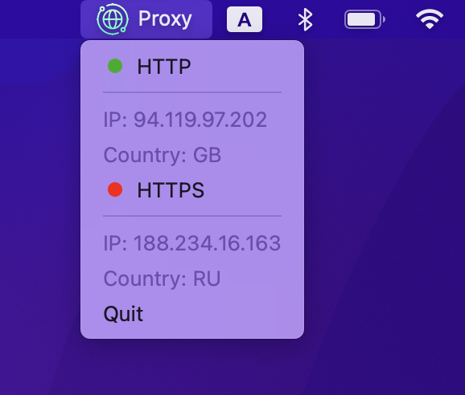
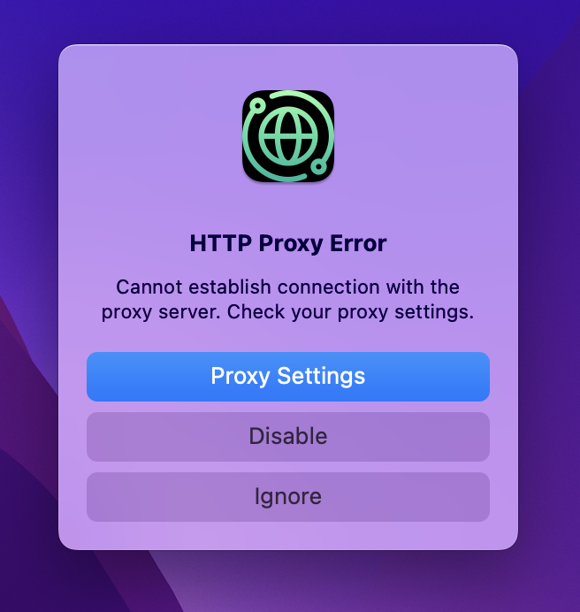

 

<h1>Proxy App</h1>

Control your macOS proxy from the menu bar. Instead of going to the proxy settings and turning proxy on/off
manually, you can now simply do it from the menu bar.

The application is written using [rumps](https://github.com/jaredks/rumps) framework.

&emsp;
